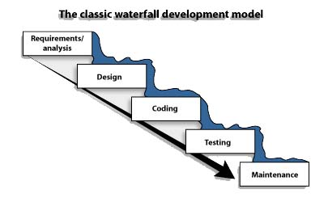

#HSLIDE

## Pycon-fr 2016

Python testing 101.

#VSLIDE

## About-me @lothiraldan

 * Python developer


#VSLIDE

## Sqreen.io

I work at sqreen.io where we bring security to every developer.


#HSLIDE

## Source code is available online

https://github.com/Lothiraldan/python-test-101-pyconfr

#HSLIDE

## What is a test?

>Checking that one aspect of the application behaves like expected. <!-- .element: class="fragment" -->

#HSLIDE

## Testing, why?

 <!-- .element: class="fragment" -->

#VSLIDE

## Seriously

* Ensure code quality. <!-- .element: class="fragment" -->
* Check that there is no regression. <!-- .element: class="fragment" -->
* Detect new bugs. <!-- .element: class="fragment" -->

#VSLIDE

## Real-reason

>"Did I just break something else with that change?" With automated tests, when I start to feel stress, I run the tests. Tests are the Programmer’s Stone, transmuting fear into boredom. "No, I didn’t break anything. The tests are all still green." - Kent Beck


#HSLIDE

## System Under Test

Let's take a `Number` class with an `is_odd` method and test it.

The piece of code we test is called `System under test`.

#VSLIDE

## Code

Let's write the function (file `main.py`):

```python
class Number():

    def __init__(self, number):
        self.number = number

    def is_odd(self):
        """ Return True is the number is odd
        """
        return self.number % 2 == 1
```

#HSLIDE

## Unittest

Unittest is a standard module in the Python standard library, it helps us structure our tests and set a standard for test discovery and running.

#VSLIDE

## Unittest 101

```python
import unittest

class IsOddTestCase(unittest.TestCase):
    def setUp(self):
        pass
    def tearDown(self):
        pass
    def test_divisible_by_11(self):
        pass

if __name__ == '__main__':
    unittest.main()
```

#VSLIDE

## Line by line

Import the standard module:

```python
import unittest
```

#VSLIDE

## Line by line

Create a TestCase, a class which usually test the same SUT. Each test will share the setUp and tearDown methods.

```python
class IsOddTestCase(unittest.TestCase):
```

#VSLIDE

## Line by line

The `setUp` method can be used for initializing an environment for all the test methods of the TestCase. It is called before each test method, for example:

```python
    def setUp(self):
        self.connection = create_db_connection()

        self.sut = MyObject(self.connection)
```

In our case we don't need it. <!-- .element: class="fragment" -->

#VSLIDE

## Line by line

The `tearDown` method can be used to clean an environment after a test. It's called after each test method, even if they fails:

```python
    def tearDown(self):
        self.connection.close()
```

#VSLIDE

## Line by line

Our test code will go in methods that starts with `test_`.

```python
    def test_is_odd_1(self):
        ...
```

#VSLIDE

## Line by line

These following lines helps us launch directly the tests when executing the file (with `python test.py`):

```python
if __name__ == '__main__':
    unittest.main()
```

#VSLIDE

## First test

Let's start with a simple example (file `tests/test_number.py`):

```python
import unittest
from main import Number

class IsOddTestCase(unittest.TestCase):

    def test_is_odd_1(self):
        number = Number(1)

        result = number.is_odd()

        self.assertTrue(result)

if __name__ == '__main__':
    unittest.main()
```

#VSLIDE

## Launch it

Let's launch it:

```bash
$> python -m tests.test_number
.
----------------------------------------------------------------------
Ran 1 test in 0.000s

OK
```

#VSLIDE

## Verbose mode

Out first test is passing, let's try again with more details:

```bash
$> python -m tests.test_number -v
test_is_odd_1 (__main__.IsOddTestCase) ... ok

----------------------------------------------------------------------
Ran 1 test in 0.000s

OK
```

#VSLIDE

## Let's add a second one

```python
class IsOddTestCase(unittest.TestCase):

    def test_is_not_odd_4(self):
        number = Number(4)

        result = number.is_odd()

        self.assertTrue(result)
```

#VSLIDE

## Launch it

```bash
$> python -m tests.test_number -v
test_is_not_odd_4 (__main__.IsOddTestCase) ... FAIL
test_is_odd_1 (__main__.IsOddTestCase) ... ok

======================================================================
FAIL: test_is_not_odd_4 (__main__.IsOddTestCase)
----------------------------------------------------------------------
Traceback (most recent call last):
  File ".../code/tests/test_number.py", line 22, in test_is_not_odd_4
    self.assertTrue(result)
AssertionError: False is not true

----------------------------------------------------------------------
Ran 2 tests in 0.000s

FAILED (failures=1)
```

#HSLIDE

## Launch it with a better test runner

```bash
pip install pytest pytest-sugar
```

```bash
pytest tests -v
```

#VSLIDE?image=images/pytest.png

#HSLIDE

## Anatomy of a test

```python
    def test_something(self):
        preparation()

        execution()

        assertions()
```

#VSLIDE

## Preparation

In the preparation phase, we prepare everything for being able to execute our test scenario. 

#VSLIDE

## Execution

In the execution phase, we call some functions and methods that should either return something or alter something in the environment.

#VSLIDE

## Assertions

In the assertions phase, we check that returns is what we expect or the environment has been altered the way we expect it to be.

#VSLIDE

## List of assertions

* assertEqual
* assertNotEqual
* assertTrue
* assertFalse
* ...

https://docs.python.org/3/library/unittest.html?highlight=unittest#assert-methods

#VSLIDE

## List of assertions

Each of these methods returns meaningfull error messages to help you quickly debug your tests. But we can customize them.

#VSLIDE

## Message customization

```python
class IsOddTestCase(unittest.TestCase):

    def test_is_not_odd_4(self):
        number = Number(4)

        result = number.is_odd()

        self.assertTrue(result, "4 should be odd")
```

#VSLIDE

## Launch it again

```python
tests/test_number.py::IsOddTestCase::test_is_not_odd_4 FAILED
tests/test_number.py::IsOddTestCase::test_is_odd_1 PASSED

======================================== FAILURES ========================================
____________________________ IsOddTestCase.test_is_not_odd_4 _____________________________

self = <tests.test_number.IsOddTestCase testMethod=test_is_not_odd_4>

    def test_is_not_odd_4(self):
        number = Number(4)

        result = number.is_odd()

>       self.assertTrue(result, "4 should be odd")
E       AssertionError: False != True : 4 should be odd

tests/test_number.py:22: AssertionError
================= 1 failed, 1 passed, 1 pytest-warnings in 0.02 seconds ==================
```

#VSLIDE

## Let's fix the `test_is_not_odd_4` test using `assertEqual` or `assertNotEqual`.

#HSLIDE

## Test severals numbers at the same time

```python
    def test_first_ten_numbers(self):
        for i in range(10):
            number = Number(i * 1)

            result = number.isOdd()

            self.assertTrue(result)
```

#VSLIDE

## Result

```python
tests/test_number.py::IsOddTestCase::test_first_ten_numbers FAILED
tests/test_number.py::IsOddTestCase::test_is_not_odd_4 PASSED
tests/test_number.py::IsOddTestCase::test_is_odd_1 PASSED

======================================== FAILURES ========================================
__________________________ IsOddTestCase.test_first_ten_numbers __________________________

self = <tests.test_number.IsOddTestCase testMethod=test_first_ten_numbers>

    def test_first_ten_numbers(self):
        for i in range(10):
            number = Number(i * 1)

            result = number.is_odd()

>           self.assertTrue(result)
E           AssertionError: False is not true

tests/test_number.py:30: AssertionError
================= 1 failed, 2 passed, 1 pytest-warnings in 0.02 seconds ==================
```

#VSLIDE

## First rule of tests

>Don't use loops in tests! NEVER!

#VSLIDE

## Instead leverage your test framework

Using `pytest.mark.parametrize`

```python
import pytest

@pytest.mark.parametrize("number", range(10))
def test_first_ten_numbers(number):
    number = Number(number * 1)

    result = number.is_odd()

    assert result is False
```

#VSLIDE

## Output

```
tests/test_number.py::IsOddTestCase::test_is_not_odd_4 PASSED
tests/test_number.py::IsOddTestCase::test_is_odd_1 PASSED
tests/test_number.py::test_first_ten_numbers[0] PASSED
tests/test_number.py::test_first_ten_numbers[1] FAILED
tests/test_number.py::test_first_ten_numbers[2] PASSED
tests/test_number.py::test_first_ten_numbers[3] FAILED
tests/test_number.py::test_first_ten_numbers[4] PASSED
tests/test_number.py::test_first_ten_numbers[5] FAILED
tests/test_number.py::test_first_ten_numbers[6] PASSED
tests/test_number.py::test_first_ten_numbers[7] FAILED
tests/test_number.py::test_first_ten_numbers[8] PASSED
tests/test_number.py::test_first_ten_numbers[9] FAILED
```

#VSLIDE

```
======================================== FAILURES ========================================
_______________________________ test_first_ten_numbers[1] ________________________________

number = <main.Number object at 0x107e11510>

    @pytest.mark.parametrize("number", range(10))
    def test_first_ten_numbers(number):
        number = Number(number * 1)

        result = number.is_odd()

>       assert result is False
E       assert True is False

tests/test_number.py:39: AssertionError
```

#VSLIDE

## Fix the test

```python
@pytest.mark.parametrize("number", range(10))
def test_first_ten_numbers(number):
    number = Number(number * 2)

    result = number.is_odd()

    assert result is False
```

#VSLIDE

## And rerun

```python
tests/test_number.py::IsOddTestCase::test_is_not_odd_4 PASSED
tests/test_number.py::IsOddTestCase::test_is_odd_1 PASSED
tests/test_number.py::test_first_ten_numbers[0] PASSED
tests/test_number.py::test_first_ten_numbers[1] PASSED
tests/test_number.py::test_first_ten_numbers[2] PASSED
tests/test_number.py::test_first_ten_numbers[3] PASSED
tests/test_number.py::test_first_ten_numbers[4] PASSED
tests/test_number.py::test_first_ten_numbers[5] PASSED
tests/test_number.py::test_first_ten_numbers[6] PASSED
tests/test_number.py::test_first_ten_numbers[7] PASSED
tests/test_number.py::test_first_ten_numbers[8] PASSED
tests/test_number.py::test_first_ten_numbers[9] PASSED
```

#HSLIDE

## Doctests

Let's add a new method `ceil`

```python
class Number():

    def ceil(self):
        """ Returns the largest integer value less than or equal to
        current number.
        """
        if self.number % 1 >= 0:
            return int(self.number) + 1
```

#VSLIDE

## Doctests késako

From the python documentation:

>The doctest module searches for pieces of text that look like interactive Python sessions, and then executes those sessions to verify that they work exactly as shown.

#VSLIDE

## First doctests

```python
    def ceil(self):
        """ Returns the largest integer value less than or equal to
        current number.
        >>> Number(2.5).ceil()
        3
        >>> import math
        >>> Number(math.pi).ceil()
        4
        """
        if self.number % 1 >= 0:
            return int(self.number) + 1
```

#VSLIDE

## Launch it

```python
$> python -m doctest main.py
python -m doctest -v main.py
Trying:
    Number(2.5).ceil()
Expecting:
    3
ok
Trying:
    import math
Expecting nothing
ok
Trying:
    Number(math.pi).ceil()
Expecting:
    4
ok
...
Test passed.
```

#VSLIDE

## With py.test

```python
$> py.test --doctest-modules tests main.py -v
tests/test_number.py::IsOddTestCase::test_is_not_odd_4 PASSED
tests/test_number.py::IsOddTestCase::test_is_odd_1 PASSED
tests/test_number.py::test_first_ten_numbers[0] PASSED
tests/test_number.py::test_first_ten_numbers[1] PASSED
tests/test_number.py::test_first_ten_numbers[2] PASSED
tests/test_number.py::test_first_ten_numbers[3] PASSED
tests/test_number.py::test_first_ten_numbers[4] PASSED
tests/test_number.py::test_first_ten_numbers[5] PASSED
tests/test_number.py::test_first_ten_numbers[6] PASSED
tests/test_number.py::test_first_ten_numbers[7] PASSED
tests/test_number.py::test_first_ten_numbers[8] PASSED
tests/test_number.py::test_first_ten_numbers[9] PASSED
tests/test_number.py::test_ceil_int PASSED
main.py::main.Number.ceil PASSED

====================== 14 passed ======================
```

#VSLIDE

## Small problem

What is the ceil of an integer?

```python
>>> import math
>>> math.ceil(3)
3
>>> import main
>>> number = main.Number(3)
>>> number.ceil()
4
```

#VSLIDE

## Second rule of tests

>Tests can only prove the presence of features, not the absence of bugs.

#VSLIDE

## Add a new test and fix the code!

#VSLIDE

## New test

```python
def test_ceil_int():
    number = Number(3)
    assert number.ceil() == 3
```

#VSLIDE

## Main.py

```python
    def ceil(self):
        """ Returns the largest integer value less than or equal to
        current number.
        >>> Number(2.5).ceil()
        3
        >>> import math
        >>> Number(math.pi).ceil()
        4
        """
        if self.number % 1 > 0:
            return int(self.number) + 1
        return self.number
```

#HSLIDE

## Code coverage

How to quantify the quality and percentage of code that has been executed when executing the test suite?

It's the code coverage.

#VSLIDE

## Get code coverage

```bash
pip install pytest-cov
```

#VSLIDE

## Launch py.test

```
$> py.test --doctest-modules tests main.py -v
...
-------- coverage: platform darwin, python 2.7.12-candidate-1 --------
Name      Stmts   Miss  Cover
-----------------------------
main.py       9      0   100%
```

#VSLIDE

## HTML version

```
$> py.test --doctest-modules tests main.py -v --cov=main --cov-report=html
```

#VSLIDE?image=images/coverage_html.png

#HSLIDE

## Development workflow



## TDD


#HSLIDE

## Fuzzing

#HSLIDE

## Mutation testing

#HSLIDE
