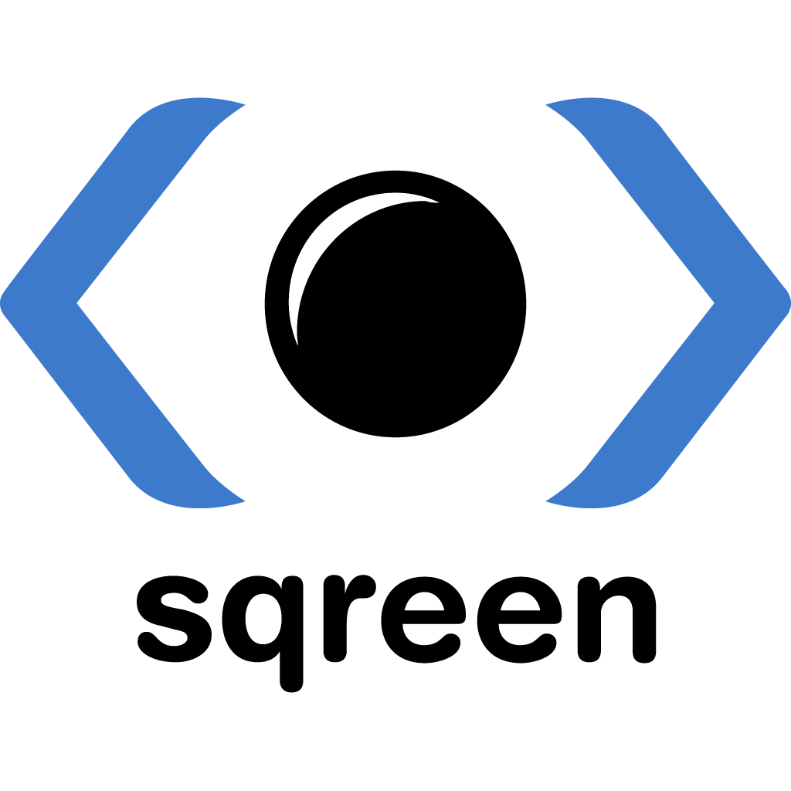

#HSLIDE

## Pycon-fr 2016

Python monkey-patching in production.

#VSLIDE

## About-me @lothiraldan

 * Python developer


#VSLIDE

## Sqreen.io

I work at sqreen.io where we bring security to every developer.



#HSLIDE

## System Under Test

Let's take a function that test divisibility by 11 that use the following property:

>A number is divisible by 11 if and only if the alternating (in sign) sum of the number’s digits is 0.

#VSLIDE

## Code

Let's write the function (file `main.py`):

```python
def divisible_by_11(number):
    """Uses above criterion to check if number is divisible by 11"""
    string_number = str(number)
    alternating_sum = sum([(-1) ** i * int(d) for i, d
                           in enumerate(string_number)])
    return alternating_sum == 0
```

#HSLIDE

## Unittest

Unittest is a standard module in the Python standard library, it helps us structure our tests and set a standard for test discovery and running.

#VSLIDE

## Unittest 101

```python
import unittest

class DivisibleBy11TestCase(unittest.TestCase):

    def setUp(self):
        ...

    def tearDown(self):
        ...

    def test_divisible_by_11(self):
        ...


if __name__ == '__main__':
    unittest.main()
```

#VSLIDE

## Line by line

Import the standard module:

```python
import unittest
```

#VSLIDE

## Line by line

Create a TestCase, a class which usually test the same SUT. Each test will share the setUp and tearDown methods.

```python
class DivisibleBy11TestCase(unittest.TestCase):
```

#VSLIDE

## Line by line

The `setUp` method can be used for initializing an environment for all the test methods of the TestCase. It is called before each test method:

```python
    def setUp(self):
        self.connection = create_db_connection()

        self.sut = MyObject(self.connection)
```

In our case we don't need it. <!-- .element: class="fragment" -->

#VSLIDE

## Line by line

The `tearDown` method can be used to clean an environment after a test. It's called after each test method, even if they fails:

```python
    def tearDown(self):
        self.connection.close()
```

#VSLIDE

## Line by line

Our test code will go in methods that starts with `test_`.

```python
    def test_divisible_by_11(self):
        ...
```

#VSLIDE

## Line by line

These following lines helps us launch directly the tests when executing the file (with `python test.py`):

```python
if __name__ == '__main__':
    unittest.main()
```

#VSLIDE

## First test

Let's start with a simple example (file `tests/test_divisible_by_11.py`):

```python
import unittest
from main import divisible_by_11

class DivisibleBy11TestCase(unittest.TestCase):

    def test_divisible_11(self):
        self.assertTrue(divisible_by_11(11))

if __name__ == '__main__':
    unittest.main()
```

#VSLIDE

## Launch it

Let's launch it:

```bash
$> python -m tests.test_divisible_by_11
.
----------------------------------------------------------------------
Ran 1 test in 0.000s

OK
```

#VSLIDE

## Verbose mode

Out first test is passing, let's try again with more details:

```bash
$> python -m tests.test_divisible_by_11
test_with_11 (__main__.DivisibleBy11TestCase) ... ok

----------------------------------------------------------------------
Ran 1 test in 0.000s

OK
```

#VSLIDE

## Let's add a second one

```python
class DivisibleBy11TestCase(unittest.TestCase):

    def test_not_divisible_9(self):
        self.assertTrue(divisible_by_11(9))
```

#VSLIDE

## Launch it

```bash
$> python -m tests.test_divisible_by_11
test_divisible_11 (__main__.DivisibleBy11TestCase) ... ok
test_not_divisible_9 (__main__.DivisibleBy11TestCase) ... FAIL

======================================================================
FAIL: test_not_divisible_9 (__main__.DivisibleBy11TestCase)
----------------------------------------------------------------------
Traceback (most recent call last):
  File ".../tests/test_divisible_by_11.py", line 11, in test_not_divisible_9
    self.assertTrue(divisible_by_11(9))
AssertionError: False is not true

----------------------------------------------------------------------
Ran 2 tests in 0.000s

FAILED (failures=1)
```

#HSLIDE

## Doctests

#HSLIDE

## TDD

#HSLIDE

## Fuzzing

#HSLIDE

## Mutation testing

#HSLIDE
